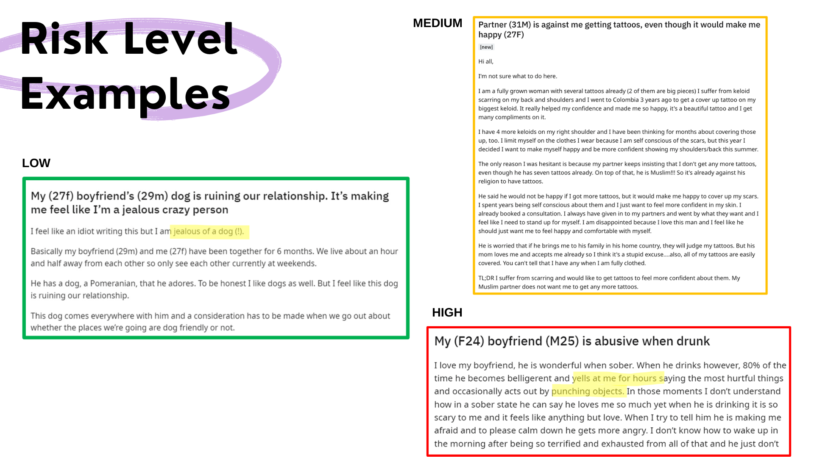
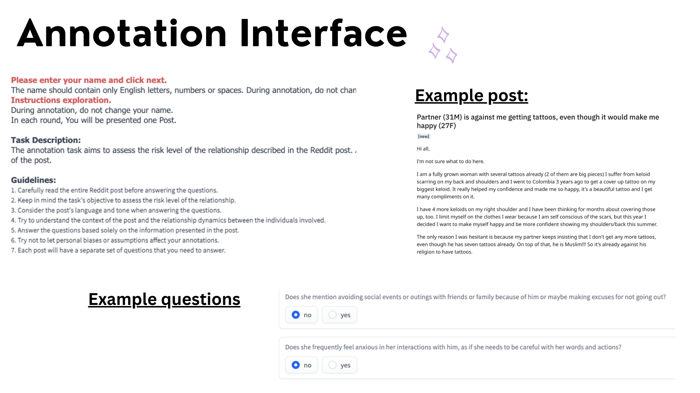
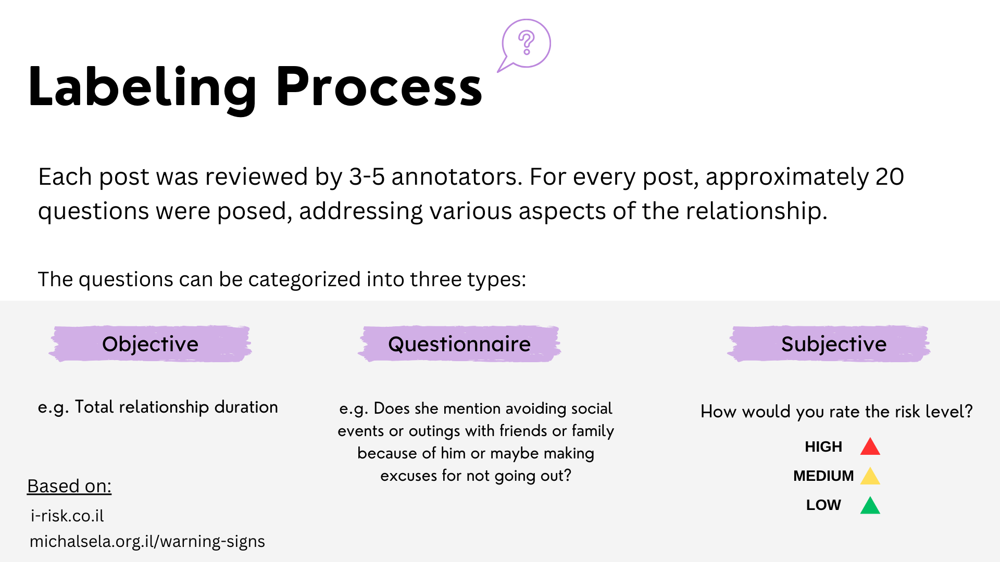
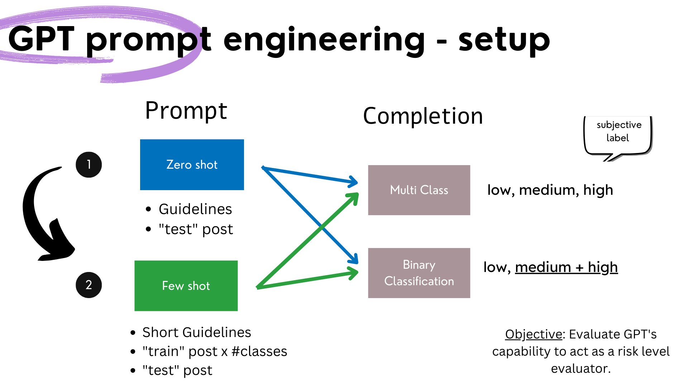
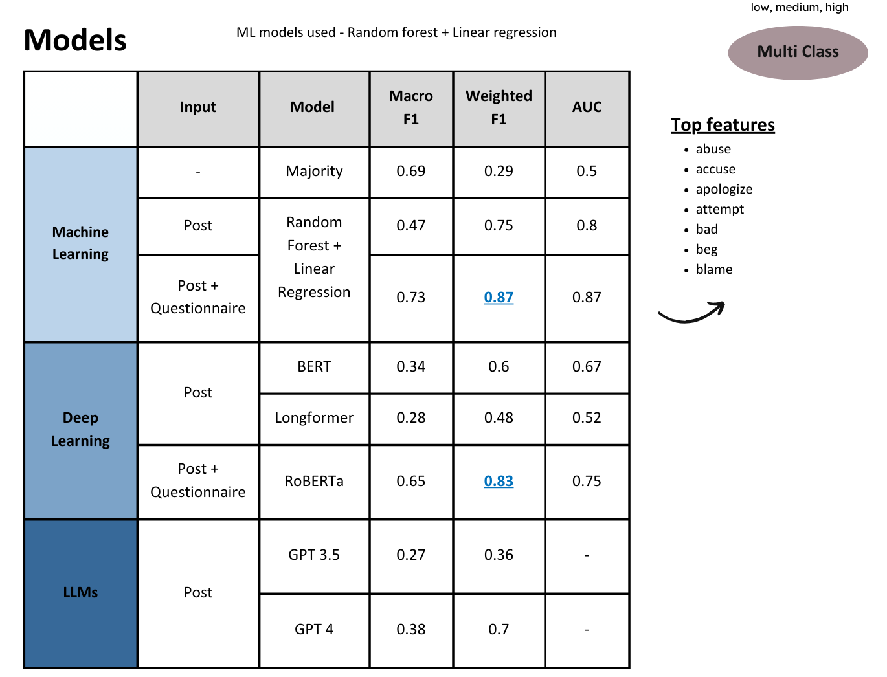

# Domestic Abuse Risk Detection from Reddit Posts

A research project evaluating potential life-threatening severity in romantic relationships based on user-submitted posts in the r/relationship_advice subreddit.

---

## 🧠 Objective

To assess the **risk level** posed to women in their relationships, as described in Reddit posts.  
Risk levels are defined as follows:

- **Low**: No evident danger.
- **Medium**: Presence of warning signs.
- **High**: Multiple warning signs and recurring harmful patterns.

---

## 📊 Dataset

- **Source**: Reddit (r/relationship_advice)
- **Size**: 300 manually annotated posts
- **Annotation**:
  - Each post was reviewed by 3–5 annotators.
  - Around 20 questions per post.
  - Questions grouped as:
    - **Subjective** (e.g., isolation from friends)
    - **Objective** (e.g., relationship duration)
    - **Open-ended**

Annotation guidelines were inspired by:
- [i-Risk](https://www.i-risk.co.il)
- [Michal Sela Forum – Warning Signs](https://michalsela.org.il/warning-signs)

### Risk level examples

## 🖊️ Annotation

Annotation was performed using a **Streamlit app** (`app.py`) hosted on a remote server. The app interface allowed annotators to view Reddit posts and respond to a predefined set of subjective, objective, and open-ended questions.

- Hosted via **port forwarding** for secure remote access (`ssh -L`).
- Each post was presented along with ~20 annotation questions.
- Annotators selected a **risk level** (Low, Medium, High) based on guideline-aligned criteria.
- Responses were automatically saved to a structured backend (e.g., CSV or database).

The app facilitated fast iteration cycles and ensured annotation consistency across multiple annotators.
Annotations were stored in a structured format for easy access and analysis.
- **Annotation Process**:
  - Annotators were trained on the guidelines and provided with examples. 
  - Posts were randomly assigned to annotators.
  - Each annotator provided their risk assessment and comments.
  - Annotations were reviewed for consistency and accuracy.

### Visualization of the Annotation Interface

### Annotation Process

## Questionnaire Analysis
- The questionnaire was designed to capture various aspects of the relationship.
- We analyzed the questionnaire responses to identify patterns and correlations with the risk levels assigned by annotators. 

## 🤖 Model Setup

### 1. Classification Tasks

- **Multiclass**: low / medium / high
- **Binary**: low vs. medium+high

### 2. Models

- Classical ML classifiers, context-free (RF, LR)
- Bert-based models (RoBERTa)
- Combined Embeddings - Bert + Questionnaire
- GPT-based evaluation via prompt engineering

---

## 🧪 GPT Prompt Engineering

**Prompt Objective**: Instruct GPT to assess relationship risk using behavioral cues, abuse indicators, and mental health risks (e.g., suicidal ideation, aggression, drug/alcohol use).

**Example Prompt Excerpt**:
> Analyze the following Reddit post written by a female discussing her relationship with a male. Carefully assess the potential life-threatening risk...

Posts were formatted into prompt-completion pairs, with model outputs compared to annotated labels.

### Visualization of the Prompt Engineering Process

---

## ✅ Evaluation

- Compared simple word-feature models with GPT outputs.
- Assessed model sensitivity to risk patterns across posts.
- Explored model agreement with human annotations.

### Evaluation Metrics
- Macro F1
- Weighted F1
- Auc

---

## 🔭 Next Steps

- Collect additional high-quality, real-world data.
- Collaborate with domestic abuse professionals for validation.
- Develop context-aware deep learning models.
- Evaluate GPT robustness across diverse post types.

